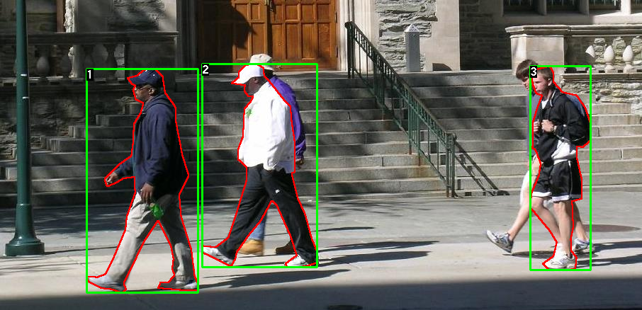
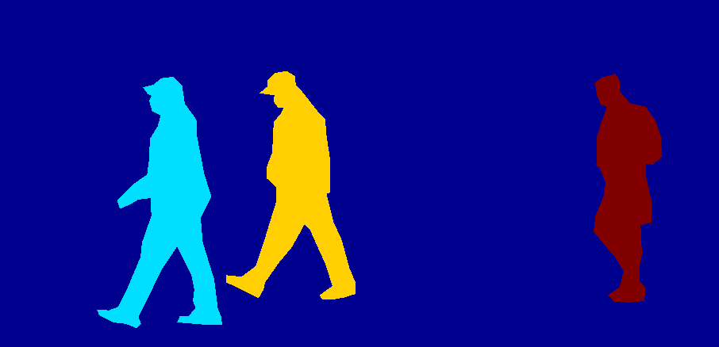

# Finetunnng an Object-detection-model
Finetuning a pre-trained Mask R-CNN model in the "Penn-Fudan Database for Pedestrain Detection and Segmentation". (https://www.cis.upenn.edu/~jshi/ped_html/)

## Dataset 
The Penn-Fudan Dataset contains 170 images with 345 instances of pedastrains. The images come in pairs; the normal image and the mask equivalent. 

image source: https://pytorch.org/tutorials/intermediate/torchvision_tutorial.html

The second image is the segmentation mask of the first image, and each colour reppresents a different human detected  

A new custom Dataset class is created, and the expected out puts include 
a) image: a PIL Image of size (H, W)
b) target: a dict containing the following fields: boxes, labels, image_id, area, iscrowd, etc. 

## Model 
Mask R-CNN model is used here. Mask R-CNN is based on Faster R-CNN.  Faster R-CNN is a model that predicts both bounding boxes and class scores for potential objects in the image.
SInce our dataset is small, we use a model pretrained on COCO dataset, and just modify the classifier. 

# Acknowledgement 
TorchVision Object Detection Finetuning Tutorial (https://pytorch.org/tutorials/intermediate/torchvision_tutorial.html#defining-your-model)
